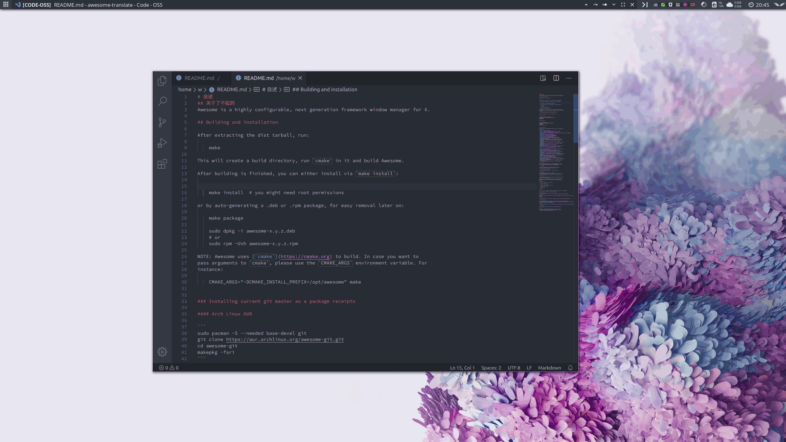
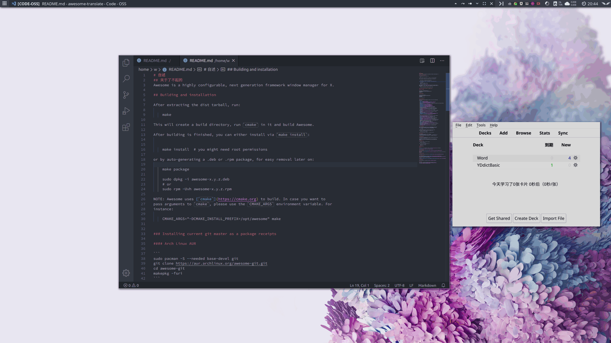
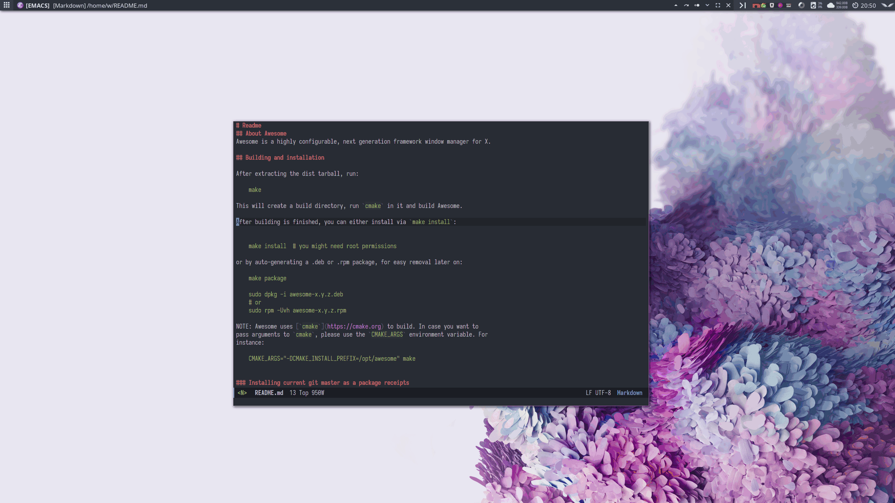

# Awesome translate

Awesome translate 是一个为 Awesome WM 编写的翻译插件，目前支持单词和整句翻译。单词可以通过 Anki-Connect 保存到Anki中。

复制单词释义


保存到Anki


在Emacs中的效果



# 安装&使用

将本项目克隆到Awesome WM的配置目录下

在配置文件中加入如下代码

``` lua
local at = require("path.to.project") --项目路径，用 . 分隔

at.init(
    {
        -- 是否使用 rofi 展示单词，false 则使用通知展示
        enable_rofi = false,
        -- 是否启用 anki
        enable_anki = true,
        -- Anki保存单词的 Desk
        anki_desk = "Word",
        -- Anki保存单词的 NodeType
        anki_model = "Word",
        -- Anki-Connect 的端口号
        anki_connect_port = 8701,
        -- Anki保存美式发音的字段
        us_audio_field = "USAudio",
        -- Anki保存英式发音的字段
        uk_audio_field = "UKAudio"
    }
)
globalkeys =
    gears.table.join(
    globalkeys,
    -- 查询快捷键
    awful.key(
        {keydefine.modkey},
        "q",
        function()
            -- query 的第二个参数表示是否自动复制
            -- at.query(selection(),true)
            at.query(selection())
        end
    ),
     -- 复制快捷键
    awful.key(
        {keydefine.modkey},
        "c",
        function()
            at.copy()
        end
    )
)

```

重新启动 Awesome WM。选中需要翻译的单词或句子，按下快捷键即可。


